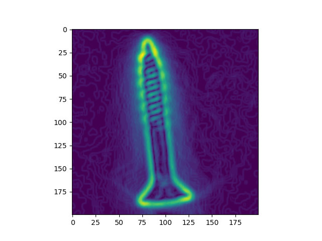
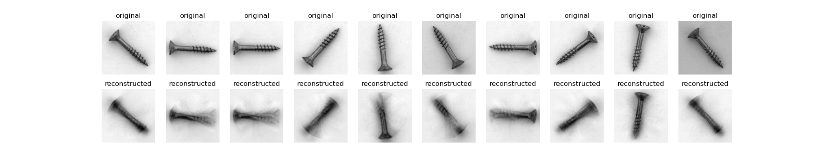
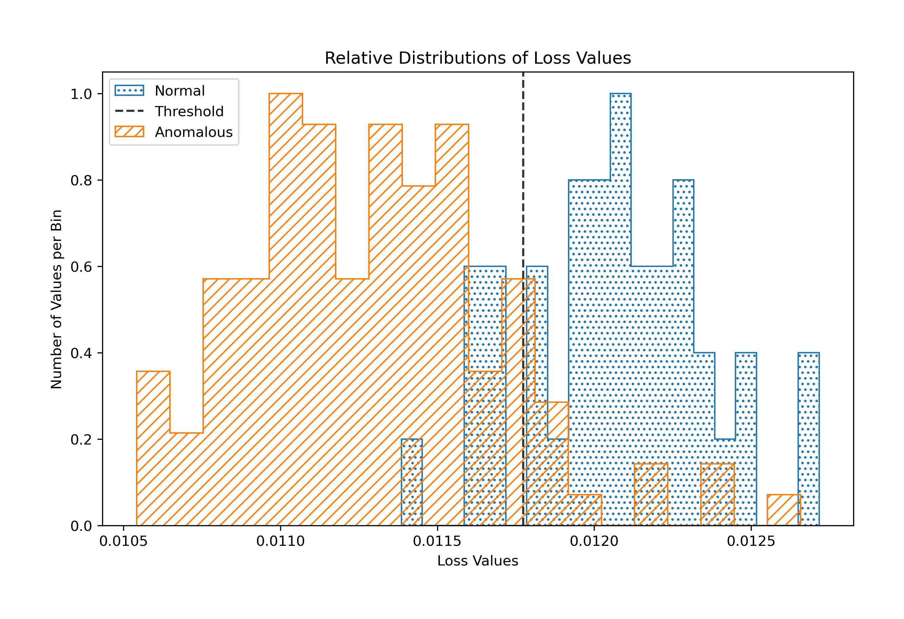
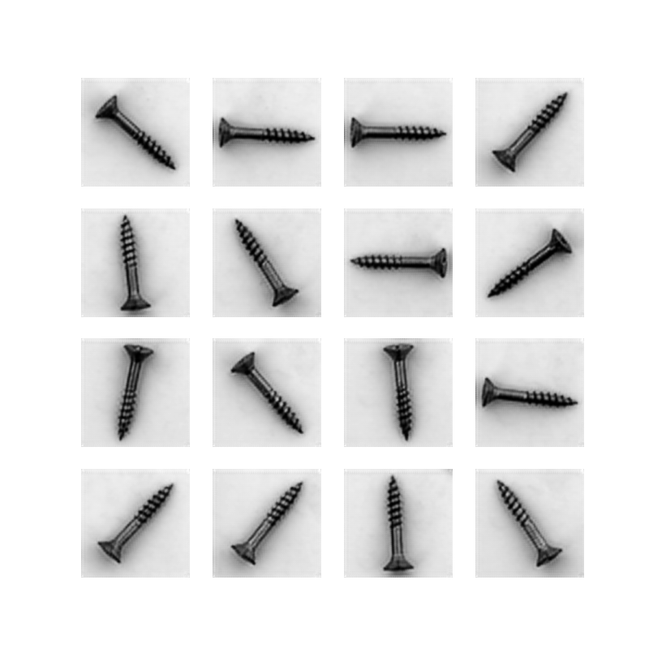

# Anomaly Detection with Autoencoders
### Phase 4 Data Science Project by Andrew Alderfer
----
</img>

## Introduction
This is the github repo for my project on Anomaly Detection. I used a dataset of some ~500 images
of screws to train a neural network and identify anomalous (damaged) screws in the test set.

Follow along below as I breifly run through the project.

## Business Understanding
The purpose of this project is to look for ways to improve or automate quality control procedures in
industrial manufacturing. The idea is to train a model to identify damaged or faulty products, in this
case screws, and remove them from the production line. 

## Data Understanding
The dataset for this project was graciously provided by <a href="https://www.mvtec.com/company/research/datasets/mvtec-ad">MVTec</a> as part of their
Anomaly Detection image set.

### Data
The data is split into a training and test set, and sub categories within the test set representing
the anomalous category of the image. This made it fairly easy to load up the data into a notebook and
get going with various autoencoding strategies.

## Modeling
A visualization of the output from my first model is pictured below:
</img>

The first model was a simple autoencoder with a series of Dense layers that compressed the data from
each image into a relatively tiny tensor and then attempted to reconstruct the original image from
that compressed version. As you can see from the image above the model had difficulty abstracting the
position of the screw in each image so the output images are blurry and distorted around the center
point of the screws.

### Final Model
The final model ended up being a multilayered convolutional network. The layers did a better job of
abstracting the orientation of the screw and its structure in the image.
</img>

With this model I was able to achieve an average accuracy rating of 86% when it came to classifing
anomalous screws. As you can see from the graph above once the model is trained I used the test set
to measure the mean-square-error between the models inputs and outputs. This resulted in two loss
distributions. A non-anomalous (normal) loss distribution and a loss distribution for anomalous input
data.

Using these distributions I calculated a classificatoin threshold and then programmed a function to
return the accuaracy rating of that threshold.

## Moving Forward
I am continuing to investigate ways of improving this process's accuracy and consistency. I am going
to try different loss functions and see if applying different preprocessing methods like sobel filtering
or other simple convolutional functions could improve performance, and focus the model on specific
features.
</img>


##### Citations:
Markus Ulrich, Patrick Follmann, Jan-Hendrik Neudeck: A comparison of shape-based matching with deep-learning-based object detection; in: Technisches Messen, 2019, DOI: 10.1515/teme-2019-0076.

-----
```shell
root
├── data
│   ├── metal_nut
│   │   ├── ground_truth
│   │   │   ├── bent
│   │   │   ├── color
│   │   │   ├── flip
│   │   │   └── scratch
│   │   ├── test
│   │   │   ├── bent
│   │   │   ├── color
│   │   │   ├── flip
│   │   │   ├── good
│   │   │   └── scratch
│   │   └── train
│   │       └── good
│   └── screw
│       ├── ground_truth
│       │   ├── manipulated_front
│       │   ├── scratch_head
│       │   ├── scratch_neck
│       │   ├── thread_side
│       │   └── thread_top
│       ├── test
│       │   ├── good
│       │   ├── manipulated_front
│       │   ├── scratch_head
│       │   ├── scratch_neck
│       │   ├── thread_side
│       │   └── thread_top
│       └── train
│           └── good
├── images
├── models
│   └── conv_model_01
│       ├── assets
│       └── variables
└── util
    ├── func
    │   └── __pycache__
    ├── models
    │   └── __pycache__
    └── __pycache__
```
